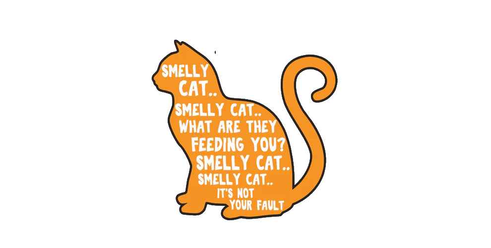

# Smellycat

### Background
Years ago I happened to eat lunch at the SCO university open air auditorium. Some lecturer was supposed to come up
and give a fun insight about ... something. To my amazement Kurt Vonnegut took the stage, and addressed the audience with the following question: "How do rhinoceroses see the world?"
The answer was: via smell. 

### Notes
- Here is
a [GPS lib sample project](https://maker.pro/raspberry-pi/tutorial/how-to-use-a-gps-receiver-with-raspberry-pi-4).
- And another [tutorial](https://maker.pro/raspberry-pi/tutorial/how-to-read-gps-data-with-python-on-a-raspberry-pi). 