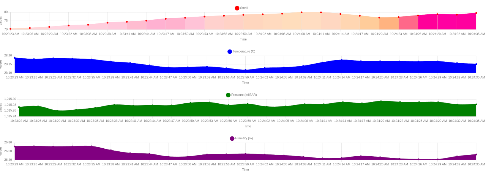
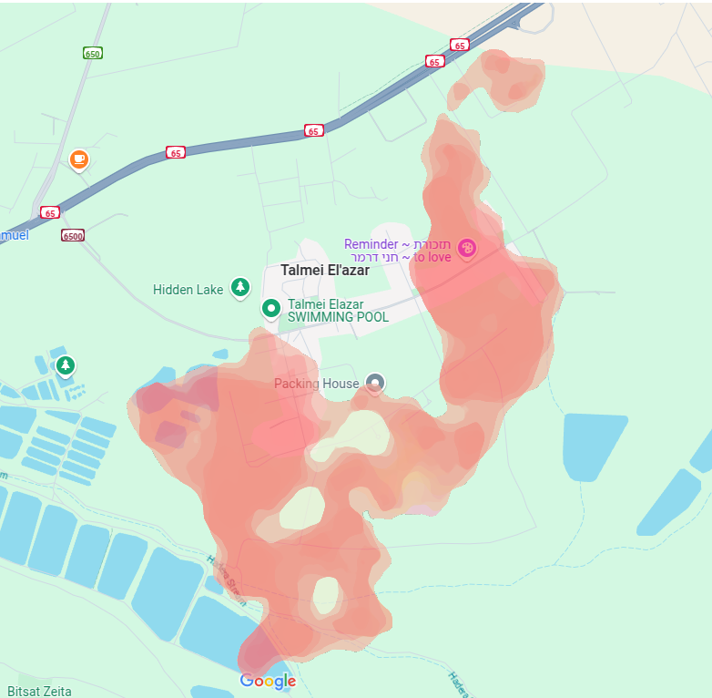
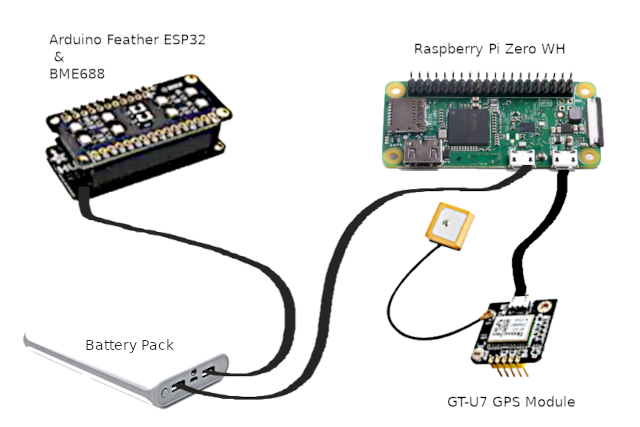
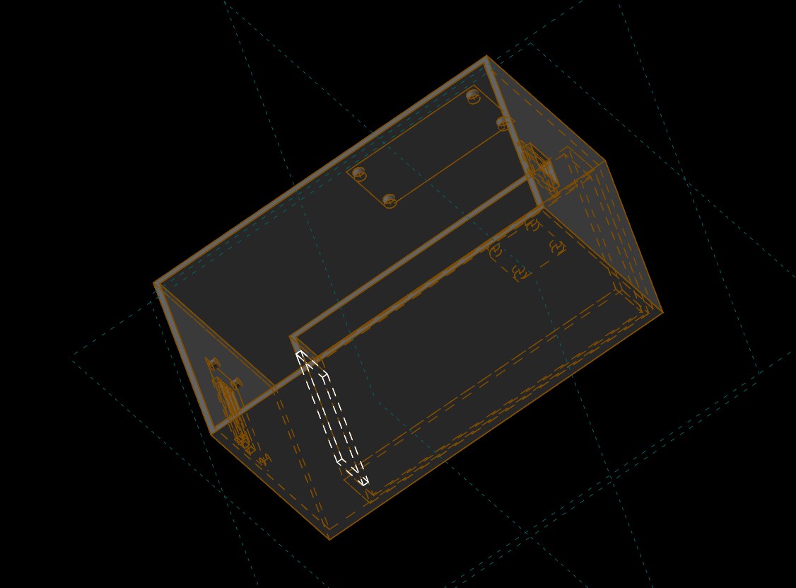
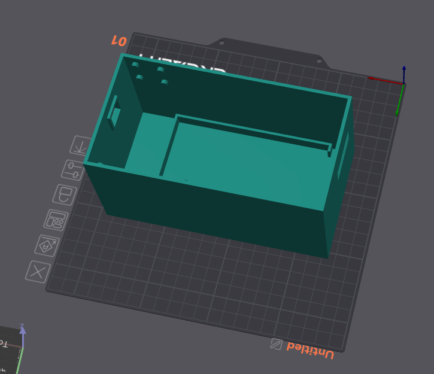

# Smelly Cat

### Background

Years ago I happened to eat lunch at the SCO university open air auditorium. Some lecturer was supposed to come up
and give a fun insight about ... something. To my amazement Kurt Vonnegut took the stage, and addressed the audience
with the following question: "How do rhinoceroses see the world?"

The answer was: via **smell**.

> “No matter what is doing the creating, I have to say that the giraffe and the rhinoceros are ridiculous.”
> ― Kurt Vonnegut, Timequake

Well, that got my attention, 30 years ago. I recently remembered that for some odd reason
and decided to build on the late Vonnegut's vision. The system quickly came to be using
a Bosch multi-sensor (BME688), an Arduino (ESP32 Feather), and a Raspberry Pi (Zero WH)
connected to a GPS module (NEO v6).

The result of this effort was a raw smell graph, and some other nice sensor readings,
such as humidity, barometric pressure and temperature (which I currently do not use),
and a finalized realtime smell map.

Figure 1: Sensors Readouts

 
To get the smell map in such a way that different smells get different colors while keeping
similar smells as similar colors, I had to employ a mapping from the 8-fold vector space
provided by the 8 gas sensors on the BME688, onto
a [metric color space](https://en.wikipedia.org/wiki/Oklab_color_space#:~:text=The%20Oklab%20color%20space%20is,stability%20and%20ease%20of%20implementation.).
The chosen metric color space was the [OkLAB](https://en.wikipedia.org/wiki/Oklab_color_space) color space.
Using PCA to transform the 8-fold sensors vector onto the lower dimensionality OkLAB colr space resulted
in a color map that was both accurate, and kept the smell-similarity.

Finally, the GPS location was cross-referenced with the sensor readout, to provide a location
where a smelled-colored hexagon was placed. Once done a median filter was applied over the hexagons
to flatten the colors into a smooth color field.

Figure 2: Geo Smell Dispersion Map

 
### Setup
Make sure to set the system to sync with the following NTP server (both on Arduino, and GPS hosts):
> sudo nano /etc/systemd/timesyncd.conf

Add/Modify the file as follows:
<pre>
[Time]
  NTP=time1.google.com time2.google.com
  ...
</pre>
Restart the service:
> sudo systemctl restart systemd-timesyncd.service

Check all is set up correctly:
> timedatectl status

### Architecture
The architecture comprises:
- BME688 gas sensor attached to an Arduino Feather ESP32 (BME688 dev kit) 
- Raspberry Pi Zero WH attached to a GT-U7 GPS module
- A battery pack with dual outputs

Figure 3: Hardware Architecture

 
The dev kit is powered by one battery port, while the Raspberry Pi hooks into the other.
The raspberry Pi is connected via micro USB to the GPS module (note that the GPS module could have
been connected directly to the Arduino, however t has no free USB port, not are its TX/RX serial pins available as they are
connected to the BME688).

The dev kit is WiFi-able, and so is the Raspberry Pi. Both are connected to as local mobile WiFi
usually via a smartphone in the vicinity. 

The modules are sending their respective data to an MQTT broker in the cloud.

The cloud server is reading both the GPS data queue, and the gas sensing queue
from the separate MQTT topics fed by the above-mentioned modules.

The server then correlates the location and gas sensing (by approximated timestamps)
and generates the _smell image_ projected on a map of the traversed area.

A 3D printed box was created to encase the modules.

### Usage

To use the _Smelly Cat_ follow the next steps:
- Set up a cloud (or any remotely accessible) server
- Install MQTT on the server, setting it up to be remotely accessible
- Install a MySQL instance on the server, setting it up to be remotely accessible 

  > Make sure your cloud server listens to MQTT port (defaults to 1883), and the MySQL port (defaults to 3306), and no firewall rules block those ports

- Create a virtual env, and run 
  > pip install -r src/requirements.txt
- git clone the project to the server, and open an SSH terminal to the server
  - Set up the config file as follows:
    - In the _smellycat.py_ main
      <pre>
      broker_config = {
          "broker": "[MQTT broker IP address, i.e. the server public IP]",
          "port": [MQTT port, default = 1883],
          "sensor_topic": "sensorData",
          "gps_topic": "gps/location",
          "username": "[MQTT username]",
          "password": "[MQTT password]",
      }
  
      db_config = {
          "user": "[DB username]",
          "password": "[DB password]",
          "host": "[DB host IP address, i.e. the server public IP]",
          "database": "enose"
      }
      </pre>
  - Run the server:
      > python src/app/smelly_server.py
  - Run the app:
      > python src/app/smellycat.py
- Once done running the above, open a browser window to 
  > http://**[server IP address]**/enose/src/app/templates/index.html 

  The smell map should display, and update every few seconds.

### Notes

- Here is
  a [GPS lib sample project](https://maker.pro/raspberry-pi/tutorial/how-to-use-a-gps-receiver-with-raspberry-pi-4)
- And another [tutorial](https://maker.pro/raspberry-pi/tutorial/how-to-read-gps-data-with-python-on-a-raspberry-pi)